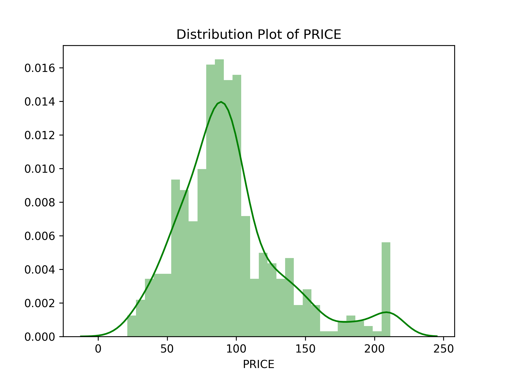
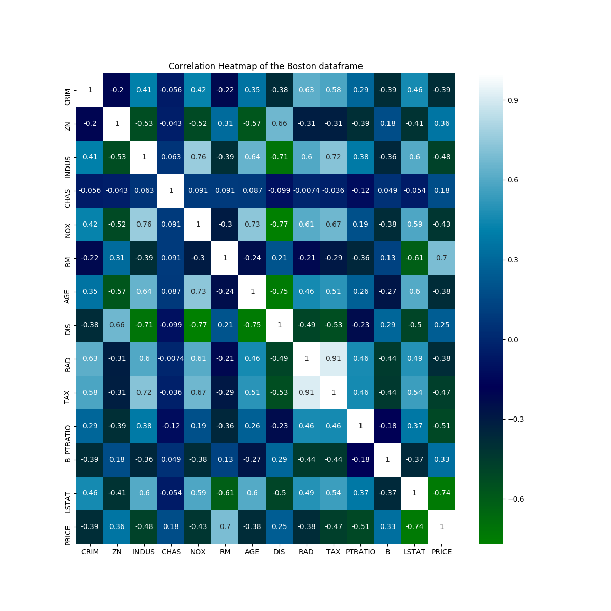
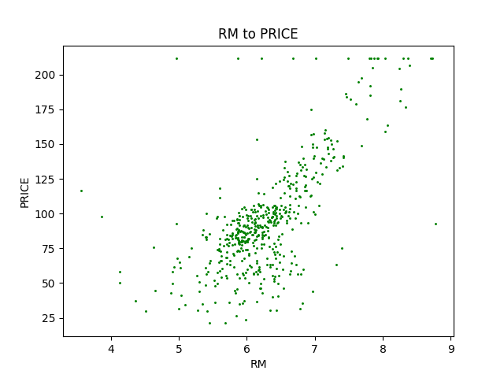
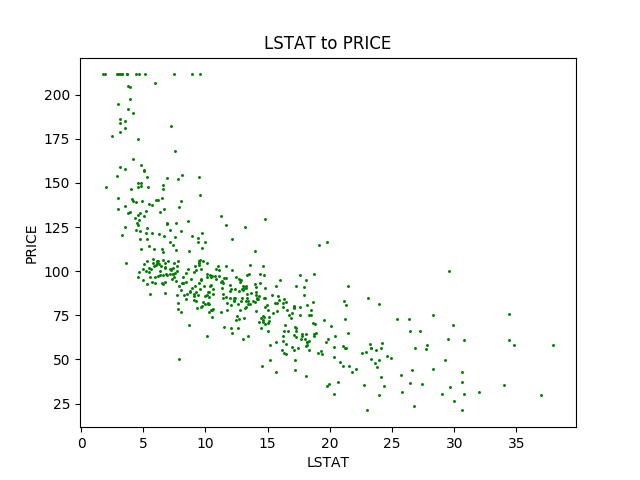
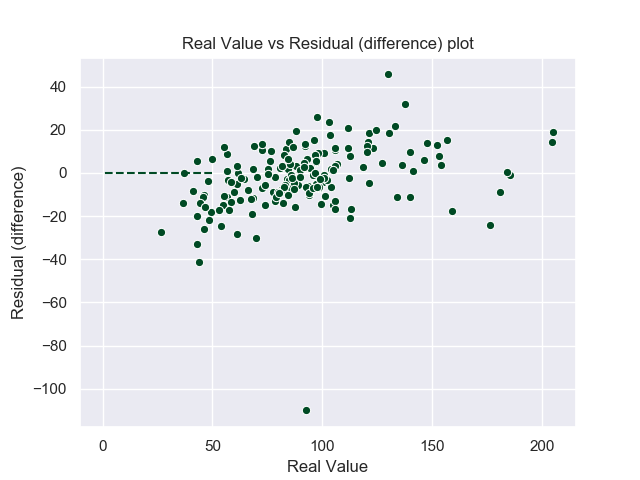

# cebd1160: predicting house pricing

| Name | Date |
|:-------|:---------------|
|Stephane Ngo|November 30, 2019|

-----

### Resources

- Python script : `Boston_prediction.py`
- Results figure/saved file :  `figures/`
- Dockerfile : `Dockerfile`
- runtime-instructions in a file named RUNME.md

-----

## Research Question

Using the Boston Housing Dataset, can we build a machine learning model to predict the value of a house?

### Abstract

The Boston Housing dataset, a well known dataset from 1978 with 506 samples with 13 features of homes as well as the price.
Using this dataset, we can attempt to train a machine learning model to predict the price of a house based on certain given variables. 
Firstly, through data exploration, we verify the integrity of the dataset and the correlation between a single variable versus the median value of a home. 
Secondly, using strongly correlated variable, we trained and tested a linear regression model to predict the price. 
With the results of the chosen estimator (GradientsBoostingRegression), we concluded that the results are not strong enough to use as a machine learning prediction. 

### Introduction

The Boston dataset for this project originates from the UCI Machine Learning Repository. The Boston housing data was collected in 1978 and each of the 506 entries represent aggregated data about 14 features for homes from various suburbs in Boston, Massachusetts. [1] 

    Number of Instances: 506 
    Number of Features: 13 numeric/categorical predictive. 
    Target: usually Column 14, Median Value of a home (renamed PRICE and adjusted for inflation)
    Missing Attribute Values: None

    Attribute Information (in order):
        - CRIM     per capita crime rate by town
        - ZN       proportion of residential land zoned for lots over 25,000 sq.ft.
        - INDUS    proportion of non-retail business acres per town
        - CHAS     Charles River dummy variable (= 1 if tract bounds river; 0 otherwise)
        - NOX      nitric oxides concentration (parts per 10 million)
        - RM       average number of rooms per dwelling
        - AGE      proportion of owner-occupied units built prior to 1940
        - DIS      weighted distances to five Boston employment centres
        - RAD      index of accessibility to radial highways
        - TAX      full-value property-tax rate per $10,000
        - PTRATIO  pupil-teacher ratio by town
        - B        1000(Bk - 0.63)^2 where Bk is the proportion of blacks by town
        - LSTAT    % lower status of the population
        - MEDV     Median value of owner-occupied homes in $1000's

### Methods

- Data exploration into the dataset and validation of integrity.  
- Adjusting the price value to account for 1978 to 2019 inflation. [1] [8]
- Creating a scatter graph of for each feature vs PRICE, a correlation heatmap and PRICE distribution graph.
- After examining these graphs, the following modifications were done : 
    - Dropping 16 lines with PRICE = 211.5 because possible false values. [1]
    
    
    - The most correlated features with PRICE that can be used to train our model: RM and LSTAT. A new dataframe created.
   
    
- Training the linear regression with different estimators (LinearRegression, Lasso, ElasticNet, GradientBoostingRegressor) and using MSE as the performance metric for predicting house price.
- Plotting the results of the real vs predicted values. Looking at the Mean Square Error.  

### Results

1. Correlation in the Boston dataset

There's is strong positive correlation, as the number of rooms increase, the house price increases.

There is a strong negative correlation, as the percentage of lower status of population, the house price decreases.

- Testing different estimators and using Mean Squared Error as the most appropriate performance metric we are predicting a numeric value (a regression problem)

| Estimator                 | MSE no drop | MSE with drop    |
| ------------------------- | ---------------- | -------------
| LinearRegression          | 510.50 | 339.95 |
| Lasso                     | 521.00 | 346.75 |
| ElasticNet                | 605.93 | 387.29 | 
| GradientBoostingRegressor | 351.67 | 234.09 |

Conclusion: Based on the lowest MSE, GradientBoostRegressor was the best estimator for this dataset. Dropping the false values of 50.00 also lowered our MSE.

### Discussion

The methods used to optimize our machine learning model did not help enough in building a robust model. This dataset has a few shortcomings, many features are not strongly correlated with price and the data is from 1978. Today's 

We suggest that in order to build a better price prediction, either more data is collected or more home features added to the dataset. This dataset does not include some key features that would affect the price of a home (year built, square footage, garage, pool, proximity to public transport)

### References

[1] ritchieng.com, Boston Home Prices Prediction and Evaluation, https://www.ritchieng.com/machine-learning-project-boston-home-prices/, site visited on November 23, 2019.

[2] MEDIUM.COM, Learning Data Science: Day 9 - Linear Regression on Boston Housing Dataset https://medium.com/@haydar_ai/learning-data-science-day-9-linear-regression-on-boston-housing-dataset-cd62a80775ef, site visited on November 23, 2019.

[3] KAGGLE.COM, Boston house price prediction https://www.kaggle.com/shreayan98c/boston-house-price-prediction, site visited on November 23, 2019.

[4] TOWARDSDATASCIENCE.COM, Linear Regression on Boston Housing Dataset https://towardsdatascience.com/linear-regression-on-boston-housing-dataset-f409b7e4a155, site visited on November 23, 2019

[5] SCIKIT-LEARN.ORG, Choosing the right estimator, https://scikit-learn.org/stable/tutorial/machine_learning_map/index.html, site visited on November 23, 2019

[6] IN2013DOLLARS.COM, price-inflation calculator, https://www.in2013dollars.com/Boston-Massachusetts/price-inflation, site visited on November 23, 2019

-------
